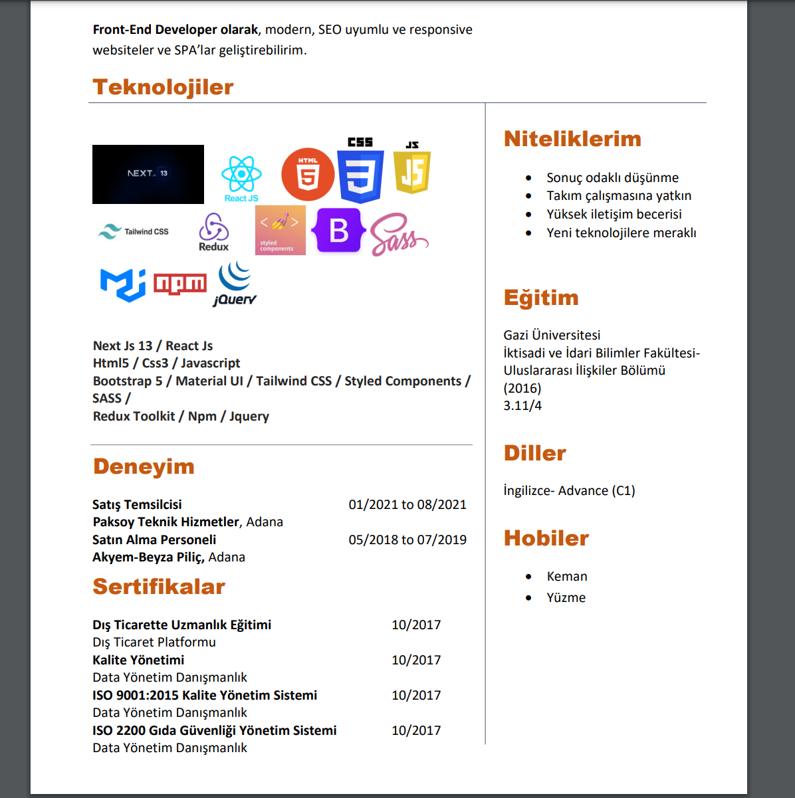
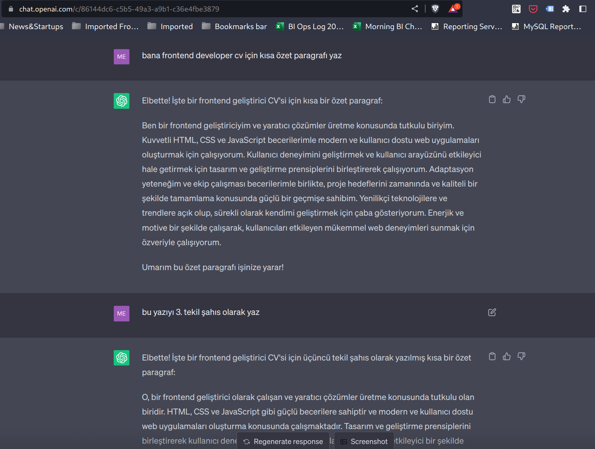
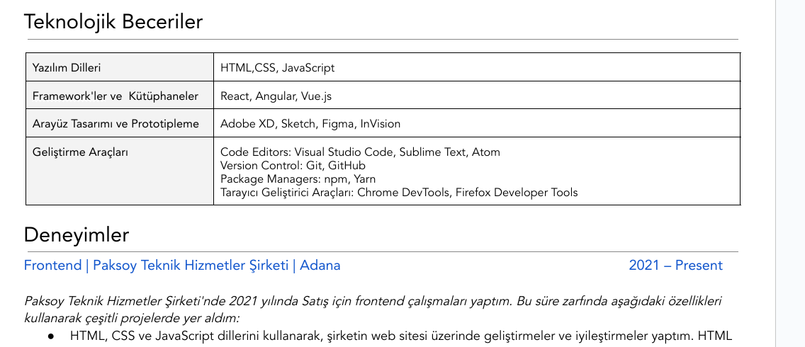

# Yapay Zeka ile Nasıl Güncel Bir CV Oluşturulur?

Günümüzde iş başvuruları, dijital dönüşümün etkisiyle daha da önem kazanmaktadır. İşverenler, CV'lerde özgün ve etkileyici bir içerik aramaktadır. Bu noktada yapay zeka teknolojileri, CV oluşturma sürecinde önemli bir rol oynamaktadır. Birlikte, yapay zeka kullanarak nasıl güncellenmiş bir CV oluşturulabileceğini inceleyelim.

<!-- truncate -->

<iframe width="711" height="533" src="https://www.youtube.com/embed/IYPii6n5SxQ" title="Yapay Zeka ile 20 dk da CV 🚀" frameborder="0" allow="accelerometer; autoplay; clipboard-write; encrypted-media; gyroscope; picture-in-picture; web-share" referrerpolicy="strict-origin-when-cross-origin" allowfullscreen></iframe>  

---  

Öncelikle, bir CV'yi güncellemek için mevcut bir CV'yi kullanabilir veya bir arkadaşınızın CV'sini temel alabilirsiniz. Bu örnekte, bir front-end geliştirici CV'si ele alınacak ve yapay zeka kullanılarak güncellenerek daha etkileyici bir hale getirilecektir.  

  

CV'nin başlangıç kısmını ele alalım. Burada, "Özet Profil" veya "Kısa Özgeçmiş" başlığını kullanarak front-end geliştirici için kısa bir özet paragrafı yazmanız gerekmektedir. Yapay zeka, kullanıcının verilerini analiz ederek bu paragrafı otomatik olarak oluşturacaktır. Örneğin, "Metin, yaratıcı çözümler üretme konusunda tutkulu bir front-end geliştiricisidir. Sürekli olarak kendini geliştirerek yenilikçi teknolojileri takip etmekte ve mükemmel web deneyimleri sunma konusunda enerjik ve motive bir şekilde çalışmaktadır."  

  

Bu paragrafı, üçüncü tekil şahıs olarak yazdırabilen yapay zeka modelleri kullanarak daha etkileyici hale getirebilirsiniz. Örneğin, "Metin, bir front-end geliştiricisi olarak çalışan ve yaratıcı çözümler üreten biridir. HD arkadaşlar, onu yenilikçi teknolojilere uyumlu siteler geliştirebilen ve kullanıcıları etkileme konusunda güçlü becerilere sahip bir model olarak tanır. Ayrıca, trendlere çıkan yenilikçi teknolojileri sürekli olarak takip etme ve kendini geliştirme konusunda da çaba göstermektedir."  

Sonraki bölüm, "Beceriler" veya "Yetenekler" başlığı altında front-end geliştiricinin sahip olduğu yazılım dilleri ve araçlarını içermektedir. Yapay zeka, bu bilgileri liste şeklinde düzenleyebilir. Örneğin, yazılım dillerini ve araçları şu şekilde listeleyebilirsiniz:  
Yazılım Dilleri:

- HTML
- CSS
- JavaScript

Frame Geliştirme Araçları:

- React
- Angular
- Vue.js

Arayüz Geliştirme Araçları:

- Adobe XD
- Sketch
- Figma

Bu şekilde, front-end geliştiricinin becerilerini açıklayıcı bir şekilde sunabilirsiniz.  

  

"Deneysimler" bölümü, front-end geliştiricinin geçmiş iş deneyimlerini içermektedir. Her bir iş deneyimi için, şirket adını, çalışma pozisyonunu ve yaptığı çalışmaları açıklayan bir paragraf yazmanız gerekmektedir. Örneğin:

Şirket: Aksoy Teknik Hizmetler  
Çalışma Pozisyonu: Front-End Geliştirici  
Çalışma Yılları: 2021 - Şu Anda  
Yaptığı Çalışmalar: Aksoy Teknik Hizmetler şirketinde front-end geliştirici olarak çalışmaktadır. Burada, kullanıcı dostu ve etkileyici web siteleri geliştirme konusunda başarılı projeler gerçekleştirmiştir. Sürekli olarak güncel trendlere ayak uydurma ve kullanıcıları etkileme konusunda öncelikli hedefleri arasında yer almaktadır.  

Bu şekilde, front-end geliştiricinin deneyimlerini vurgulayabilirsiniz. Aynı şekilde diğer iş deneyimleri için de benzer paragraflar yazabilirsiniz.  

Son olarak, CV'nin son kısmında "Eğitim Bilgileri", "Sertifikalar" ve "Referanslar" gibi bölümleri ekleyebilirsiniz. Bu bölümlerde, ilgili eğitim kurumları, aldığı sertifikalar ve referanslar hakkında bilgi verebilirsiniz.  

Yapay zeka ile güncellenen CV'niz, kullanıcılar arama yaptığında veya filtre uyguladığında ön plana çıkacaktır. CV içeriğindeki anahtar kelimeler, yapay zeka tarafından analiz edilecek ve arama sonuçlarında görünmenizi sağlayacaktır.  

Sonuç olarak, yapay zeka teknolojileri kullanarak güncellenen bir CV oluşturmak, iş başvurularınızı daha etkileyici hale getirmenize yardımcı olabilir. Özgün ve dikkat çekici bir CV, işverenlerin ilgisini çekmenizde büyük bir rol oynayacaktır. Yapay zekanın sunduğu imkanlardan faydalanarak, CV'nizi başarılı bir şekilde oluşturabilir ve iş arama sürecinde avantaj elde edebilirsiniz.  

Güncellenmiş CV'nizi oluştururken yapay zekanın sadece bir araç olduğunu ve kişisel dokunuşunuzun da önemli olduğunu unutmayın. Kendinizi en iyi şekilde ifade etmek için yapay zekayı doğru bir şekilde kullanarak özgün ve dikkat çekici bir CV oluşturabilirsiniz. Başarılar dileriz!  
