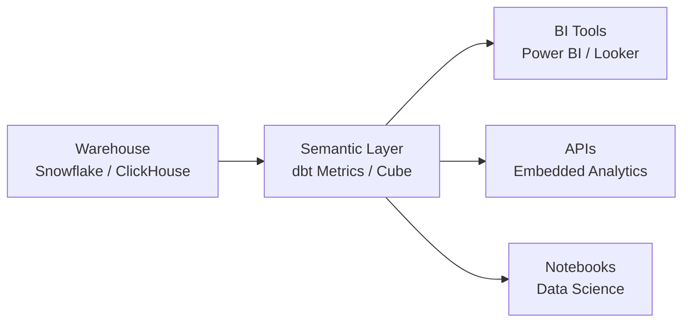

# Semantic Layer Design

The **semantic layer** sits between the data warehouse and BI tools. It translates raw warehouse tables into business-friendly metrics, dimensions, and relationships.

---

## What Is a Semantic Layer?

Without a semantic layer:

- Each BI report defines its own business logic
- Metric definitions diverge across tools
- SQL duplication is widespread
- Governance is nearly impossible

With a semantic layer:

- Business logic is defined once and reused everywhere
- Metrics are consistent across all consumers
- Changes propagate automatically

---

## Positioning in the Data Stack



The semantic layer serves multiple consumers from a single definition.

---

## Key Responsibilities

### Metric Definitions

The semantic layer owns:

- Calculation logic (`SUM`, `COUNT DISTINCT`, `RATIO`)
- Filter conditions (e.g., exclude cancelled orders)
- Time grain behavior (daily, weekly, monthly)

---

### Dimension Management

Provides:

- Consistent dimension labels across datasets
- Hierarchy definitions (Year → Quarter → Month)
- Attribute descriptions for business users

---

### Access Control

The semantic layer can enforce:

- Row-level security
- Column-level masking
- Dataset-level access rules

This removes security responsibilities from individual reports.

---

## Semantic Layer Options

| Tool | Approach | Best For |
| ---- | -------- | -------- |
| **dbt Semantic Layer** | Code-first, Git-managed | dbt-heavy stacks |
| **Cube** | API-first, headless BI | Multi-tool environments |
| **Power BI Datasets** | GUI-based, Microsoft ecosystem | Power BI-only deployments |
| **Looker (LookML)** | Proprietary modeling language | Looker-centric orgs |

---

## dbt Semantic Layer

dbt's semantic layer uses `metrics:` definitions in YAML alongside mart models.

Example metric definition:

```yaml
metrics:
  - name: order_revenue
    label: Order Revenue
    model: ref('fct_orders')
    description: Total gross revenue from completed orders
    type: sum
    sql: revenue_gross
    filters:
      - field: status
        operator: '!='
        value: "'cancelled'"
    time_grains: [day, week, month, quarter, year]
    dimensions:
      - country
      - product_category
```

---

## Design Principles

### 1. One Definition per Metric

Every business metric has exactly one canonical definition in the semantic layer.

- Never duplicate metric logic across reports
- If a definition needs to change, change it in one place

---

### 2. Keep Semantic Layer Thin

The semantic layer should reference mart tables, not raw or staging:

```
raw → stg → base → int → mart → semantic layer
```

The mart layer handles transformation. The semantic layer handles definition.

---

### 3. Version and Test Metrics

Treat metric definitions as code:

- Store in Git
- Run automated tests (value ranges, null checks)
- Review changes like code changes

---

### 4. Separate Presentation from Logic

The semantic layer defines **what** a metric is.

The BI tool defines **how** it is displayed.

Never embed display logic (colors, formatting) in the semantic layer.

---

## Common Pitfalls

### Defining Metrics in the BI Tool

Metrics defined inside a BI tool are:

- Not versionable
- Not testable
- Not reusable across tools

Always push metric logic upstream.

---

### Over-Exposing Raw Columns

The semantic layer should not expose every warehouse column.

Expose only:

- Certified, named metrics
- Approved dimensions
- Documented relationships

---

## Governance Checklist

Before publishing a metric to the semantic layer:

- [ ] Business owner has approved the definition
- [ ] Formula is documented and tested
- [ ] Filters are explicit and justified
- [ ] Time grain behavior is specified
- [ ] Access controls are applied if needed

---

## Summary

The semantic layer is the **governance boundary** between engineering and analytics:

- Engineers own the warehouse models
- The semantic layer owns the business definitions
- BI tools own the presentation

This separation ensures consistency, reusability, and maintainability at scale.

---

## Related Docs

- [Metrics Design Principles](./metrics-design.md) — defining reliable metrics before exposing them in the semantic layer
- [Power BI Architecture](./powerbi-architecture.md) — BI consumption layer sitting above the semantic layer
- [dbt Project Structure](../tooling/dbt/dbt-project-structure.md) — where dbt metric YAML files live in the project
- [Dimensional Modeling](../data-modeling/dimensional-modeling.md) — mart layer that the semantic layer reads from
