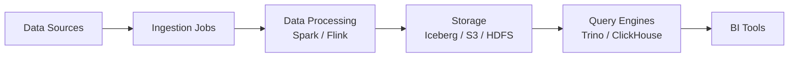

# Kubernetes for Modern Data Platforms

This document explains **why Kubernetes has become the default runtime** for modern data platforms and how it enables **scalability, portability, and operational standardization**.

---

## Why Kubernetes for Data?

Historically, data platforms were deployed on:

- Static VMs
- Dedicated clusters
- Vendor-managed services

These approaches create:

- Vendor lock-in
- Limited scalability
- Operational inconsistency

Kubernetes solves these problems by providing a **unified control plane** for compute workloads.

---

## Core Benefits

### 1. Environment Standardization

Kubernetes provides:

- Same deployment model across environments
- Infrastructure abstraction
- Consistent CI/CD workflows

This eliminates:

- Snowflake deployments per environment
- Manual infra drift
- OS-level dependencies

---

### 2. Elastic Scalability

Kubernetes enables:

- Horizontal pod scaling
- Auto-provisioning nodes
- Dynamic resource allocation

This is critical for:

- ETL workloads
- Spark jobs
- Ad-hoc analytics

---

### 3. Cost Optimization

Compared to static clusters:

- Idle resources are minimized
- Autoscaling reduces compute waste
- Multi-tenant clusters improve utilization

---

### 4. Platform Independence

Kubernetes provides true portability:

Run anywhere:

* On-premise
* AWS / Azure / GCP
* Hybrid environments

This avoids vendor lock-in.

---

## Kubernetes in a Typical Data Architecture

Kubernetes orchestrates **all compute layers**.

---

## Typical Data Components Running on Kubernetes

### Compute Layer

* Spark
* Flink
* dbt runners
* ETL pipelines

---

### Storage Interfaces

Kubernetes does NOT replace storage.

Instead, it integrates with:

* Object storage (S3, MinIO)
* Distributed file systems
* External databases

---

### Query Engines

Common Kubernetes-native deployments:

* Trino
* ClickHouse
* Presto
* Dremio

---

### Orchestration & Workflow

Typical tools include:

* Airflow
* Dagster
* Argo Workflows

---

## Kubernetes vs Traditional Clusters

| Feature         | Traditional Clusters | Kubernetes  |
| --------------- | -------------------- | ----------- |
| Scaling         | Manual               | Automatic   |
| Deployment      | Scripts              | Declarative |
| Multi-tenant    | Hard                 | Native      |
| Portability     | Low                  | High        |
| Cost efficiency | Medium               | High        |

---

## Golden Rules for Data on Kubernetes

* Storage should be externalized
* Stateless compute is preferred
* Autoscaling must be enabled
* Workloads must be containerized
* Observability is mandatory

---

## When NOT to Use Kubernetes

Kubernetes may be unnecessary when:

* Small single-node deployments
* Very low workload volume
* Fully managed SaaS is acceptable

---

## Summary

Kubernetes is now the **standard runtime layer** for modern data platforms because it provides:

* Scalability
* Portability
* Cost control
* Operational consistency

It acts as the **foundation layer**, while data engines run on top.
