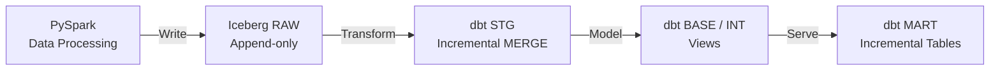

# Lakehouse - Warehouse + dbt Norms & Standards

This document defines **enterprise-grade, scalable, and cost-efficient** standards for a **PySpark + S3 Iceberg + Snowflake External Volume + dbt** architecture.

---

## Architecture Overview



Reference: [*How we made dbt runs 30% faster – dbt Labs*](https://www.getdbt.com/blog/how-we-made-dbt-runs-30-faster)  

---

## Layer Definitions

### Recommended Layer Order

The **mandatory and recommended dbt layer order** is:

```
raw → stg → base → int → mart
```

**Rationale**

* **stg**: technical normalization of raw data (type casting, deduplication, latest state)
* **base**: preparation layer for business logic
* **int**: combines multiple base models for reuse

> Some legacy dbt materials use `raw → base → stg`.
> In this standard, **stg and base have strictly separated responsibilities**.

---
### Naming Conventions

**File names.** Creating a consistent pattern of file naming is [crucial in dbt](/blog/on-the-importance-of-naming). File names must be unique and correspond to the name of the model when selected and created in the warehouse. We recommend putting as much clear information into the file name as possible, including a prefix for the layer the model exists in, important grouping information, and specific information about the entity or transformation in the model.


| Layer        | Prefix                         | Example                             | Explanation                                                                                                                                                                                                                                                                                                                                                                                                                                                                                                                                                                |
| ------------ | ------------------------------ | ----------------------------------- | -------------------------------------------------------------------------------------------------------------------------------------------------------------------------------------------------------------------------------------------------------------------------------------------------------------------------------------------------------------------------------------------------------------------------------------------------------------------------------------------------------------------------------------------------------------------------- |
| Raw (source) | `raw_[source]__[entity]s.sql`  | `raw_dce__orders.sql`               | the double underscore between source system and entity helps visually distinguish the separate parts in the case of a source name having multiple words. For instance, `google_analytics__campaigns` is always understandable, whereas to somebody unfamiliar `google_analytics_campaigns` could be `analytics_campaigns` from the `google` source system as easily as `campaigns` from the `google_analytics` source system. Think of it like an [oxford comma](https://www.youtube.com/watch?v=P_i1xk07o4g), the extra clarity is very much worth the extra punctuation. |
| Staging      | `stg_[source]__[entity]s.sql`  | `stg_i2i__payments.sql`             | -                                                                                                                                                                                                                                                                                                                                                                                                                                                                                                                                                                          |
| Base         | `base_[source]__[entity]s.sql` | `base_dce__customer.sql`            | -                                                                                                                                                                                                                                                                                                                                                                                                                                                                                                                                                                          |
| Intermediate | `int_[entity]s_[verb]s.sql`    | `int_customer_orders.sql`           | -                                                                                                                                                                                                                                                                                                                                                                                                                                                                                                                                                                          |
| Mart         | `fct_`, `dim_`                 | `fct_sales.sql`, `dim_customer.sql` | -                                                                                                                                                                                                                                                                                                                                                                                                                                                                                                                                                                          |

---

## Layer Responsibilities and Standarts

| Layer    | Purpose                           | Characteristics          |
| -------- | --------------------------------- | ------------------------ |
| **raw**  | Immutable source history          | Append-only, incremental |
| **stg**  | Technical cleanup & current state | Incremental + merge      |
| **base** | Business-ready entities           | Mostly views             |
| **int**  | Reusable joins & enrichments      | Views (preferred)        |
| **mart** | Analytics & reporting             | Tables / incremental     |

---

### `RAW` Layer Standards (Iceberg)

#### Loading Strategy

* Append-only incremental ingestion
* **UPDATE / DELETE is not allowed**
* Every change creates a new record (full history preserved)

#### Mandatory Technical Columns

| Column      | Type      | Description                         |
| ----------- | --------- | ----------------------------------- |
| `etl_date`  | DATE      | Partition key                       |
| `etl_time`  | TIMESTAMP | Load timestamp                      |
| `row_hash`  | BIGINT    | Hash generated with `xxhash64`      |
| `_batch_id` | STRING    | Optional batch identifier           |
| `_op`       | STRING    | Optional operation flag (I / U / D) |

#### Hashing Standard

* Hash is generated **on the Spark side**
* Algorithm: `xxhash64`
* Input: business key columns (null-safe)

**Purpose**

* Merge key in stg
* Change detection

#### Partitioning Standard

```
PARTITION BY etl_date
```

* Daily partitioning is mandatory
* `etl_time` **must not** be used as a partition key

---

### `STG` Layer Standards (dbt)

#### Materialization

```yaml
materialized: incremental
incremental_strategy: merge
unique_key: row_hash
```

#### Incremental Filter (Sliding Window)

* A **2-day buffer** is mandatory for late-arriving data

```sql

where etl_date >= (
  select dateadd(day, -2, max(etl_date)) from {{ this }}
)

```

#### Responsibilities of STG Models

* Latest record selection
* Deduplication
* Type casting
* Soft-delete filtering

> **No business logic is allowed** in the stg layer.

---


### `BASE` & `INT` Layer Standards

#### Default Materialization

| Layer | Default |
| ----- | ------- |
| base  | `view`  |
| int   | `view`  |

#### When to Use TABLE Instead of VIEW

* Large or expensive join chains
* Heavily reused intermediate datasets
* Proven performance bottlenecks

> Views are preferred unless there is a strong reason.

---

### `MART` Layer Standards

#### Materialization Strategy

| Scenario         | Recommendation |
| ---------------- | -------------- |
| Fact tables      | `incremental`  |
| Small dimensions | `table`        |
| Large dimensions | `incremental`  |

#### Should NOT Be Incremental

* Reference / lookup tables
* Small full-snapshot tables

---

## dbt Project Standards

### Folder Structure

```bash
dbt_project/
├── models/
│   ├── raw/        # source.yml only
│   ├── stg/        # incremental + merge
│   ├── base/       # business-ready views
│   ├── int/        # joins / enrichments
│   └── mart/
│       ├── fct/
│       └── dim/
├── macros/
├── tests/
└── snapshots/      # optional
```

---

### Default Materializations (`dbt_project.yml`)

```yaml
models:
  project_name:
    stg:
      +materialized: incremental
    base:
      +materialized: view
    int:
      +materialized: view
    mart:
      +materialized: table
```

> Incremental mart models must explicitly override this.

---

### dbt Variables Standard

```yaml
vars:
  raw_incremental_days: 2
  default_timezone: 'UTC'
```

Usage example:

```sql
where etl_date >= (
  select dateadd(day, -{{ var('raw_incremental_days') }}, max(etl_date))
  from {{ this }}
)
```

---

### dbt Tagging Standard

| Tag               | Purpose              | Mandatory |
| ----------------- | -------------------- | --------- |
| `layer:raw`       | Source definition    | yes       |
| `layer:stg`       | Staging models       | yes       |
| `layer:base`      | Base models          | yes       |
| `layer:int`       | Intermediate models  | yes       |
| `layer:mart`      | Mart models          | yes       |
| `incremental`     | Incremental model    | optional  |
| `full_refresh_ok` | Full refresh allowed | optional  |
| `heavy`           | Expensive model      | optional  |
| `pii`             | Sensitive data       | optional  |

Example:

```sql
{{ config(tags=['layer:stg', 'incremental']) }}
```

---

## Testing & Data Quality Standards

### Mandatory Tests

* `row_hash` → unique (stg)
* Business key → not null
* `etl_date` → not null

### Recommended Tests

* Accepted values
* Freshness checks (raw)
* Volume anomaly detection

---

## Performance & Cost Rules

* Full table scans are **not allowed**
* Incremental models must use partition filters
* `row_number()` only during stg build
* Dashboards must not query raw or stg layers

---

## Golden Rules

* Raw is never a state table
* History lives in raw, current state in stg
* The most expensive transformation runs **only once**
* Incremental models must be a conscious decision
* Fix models before scaling warehouses

---
