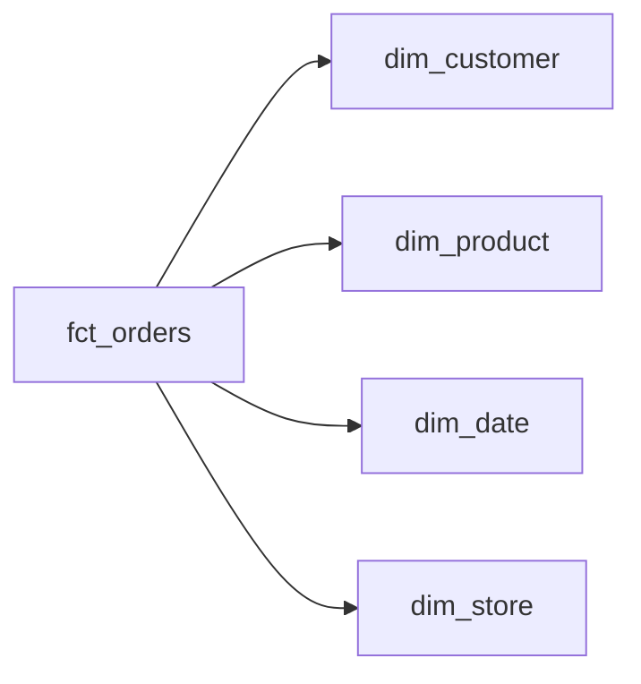

# Dimensional Modeling

**Dimensional modeling** is the standard technique for structuring data warehouses for analytical queries. It organizes data into **fact tables** and **dimension tables** to optimize read performance and business usability.

---

## Core Concepts

### Fact Tables

Fact tables store **measurable events** — the things you want to analyze.

Characteristics:

- Contain numeric measures (`revenue`, `quantity`, `duration`)
- Contain foreign keys to dimension tables
- Represent business processes at a defined grain

Examples:

- `fct_orders` — one row per order line
- `fct_pageviews` — one row per page view event
- `fct_transactions` — one row per financial transaction

---

### Dimension Tables

Dimension tables store **descriptive context** for fact records.

Characteristics:

- Contain attributes used for filtering and grouping
- Connected to fact tables via surrogate or natural keys
- Usually small relative to fact tables

Examples:

- `dim_customer` — customer attributes
- `dim_product` — product catalog
- `dim_date` — calendar attributes

---

## Star Schema

The most common dimensional modeling pattern.



Characteristics:

- Fact table in the center
- Denormalized dimensions (all attributes in one table)
- Fast query performance due to fewer joins
- Preferred for most BI workloads

---

## Snowflake Schema

A normalized variant of the star schema where dimension tables are further broken down.


Tradeoffs:

| Aspect | Star Schema | Snowflake Schema |
| ------ | ----------- | ---------------- |
| Query Performance | Higher | Lower |
| Storage | More | Less |
| Complexity | Simple | Higher |
| BI Tool Compatibility | Better | Moderate |

> **Prefer star schema** unless storage constraints or normalization requirements justify snowflaking.

---

## Grain Definition

The grain is the most important decision in dimensional modeling.

The grain defines:

> What does one row in the fact table represent?

Examples:

| Fact Table | Grain |
| ---------- | ----- |
| `fct_orders` | One row per order line item |
| `fct_sessions` | One row per user session |
| `fct_daily_sales` | One row per product per store per day |

Rules:

- Define the grain before modeling
- Every fact table must have a single, consistent grain
- Never mix grains in the same fact table

---

## Surrogate Keys

Dimension tables use **surrogate keys** — synthetic, system-generated integer keys.

Why surrogate keys:

- Source system keys can change or be reused
- Enables slowly changing dimension history
- Consistent join behavior across sources

```sql
-- Surrogate key generated in dbt
{{ dbt_utils.generate_surrogate_key(['customer_id', 'source_system']) }} as customer_sk
```

---

## Date Dimension

Every fact table should join to a `dim_date` table.

Minimum columns:

| Column | Example |
| ------ | ------- |
| `date_key` | 20240315 |
| `full_date` | 2024-03-15 |
| `day_of_week` | Friday |
| `week_of_year` | 11 |
| `month_name` | March |
| `quarter` | Q1 |
| `year` | 2024 |
| `is_weekend` | false |
| `is_holiday` | false |

Pre-building the date dimension avoids expensive date function calls in queries.

---

## Conformed Dimensions

A **conformed dimension** is shared across multiple fact tables.

Example: `dim_customer` is used in both `fct_orders` and `fct_support_tickets`.

Benefits:

- Consistent customer attributes across all reports
- Enables drill-across analysis between fact tables
- Reduces duplication in modeling

---

## Degenerate Dimensions

A **degenerate dimension** is a dimension attribute stored directly in the fact table with no corresponding dimension table.

Common examples:

- Order number
- Invoice number
- Transaction ID

These are identifiers that carry no additional attributes beyond the key itself.

---

## Junk Dimensions

Low-cardinality flags and indicators that don't belong to any natural dimension can be grouped into a **junk dimension**.

Example:

```
fct_orders → dim_order_flags
  is_first_order: true/false
  is_promotion_applied: true/false
  is_gift: true/false
```

This keeps fact tables clean without inflating dimension count.

---

## Golden Rules

- Define the grain before writing any SQL
- Use surrogate keys for all dimension tables
- Denormalize dimensions (star schema is default)
- Conformed dimensions must be identical across fact tables
- Never store measures in dimension tables
- Date dimension is mandatory for every time-series fact table

---

## Summary

Dimensional modeling provides:

- **Simplicity**: Business users understand stars
- **Performance**: Fewer joins, optimized for aggregation
- **Consistency**: Conformed dimensions ensure alignment

It remains the most widely adopted pattern for analytics data warehouses.

---

## Related Docs

- [Fact Table Design](./fact-table-design.md) — grain definition, fact types, mandatory columns, incremental patterns
- [Slowly Changing Dimensions](./slowly-changing-dimensions.md) — SCD types 0–3, dbt snapshot implementation
- [Power BI Semantic Model](./powerbi-semantic-model.md) — applying dimensional modeling principles in Power BI
- [Warehouse Standards](../architecture/warehouse-standards.md) — layer definitions and dbt naming conventions
